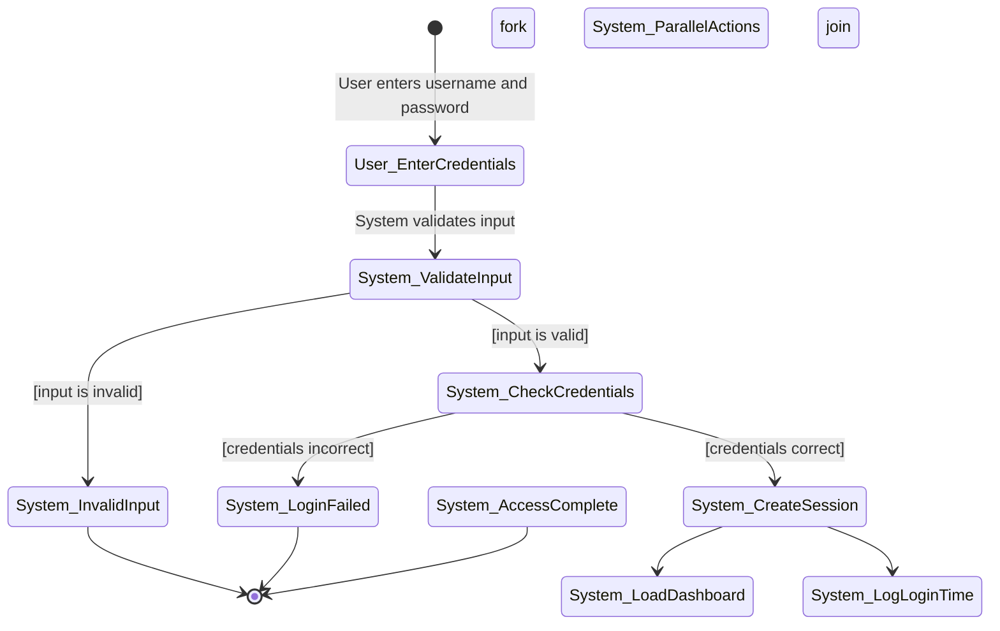

```mermaid
stateDiagram-v2
    [*] --> User_EnterCredentials : User enters username and password
    User_EnterCredentials --> System_ValidateInput : System validates input

    System_ValidateInput --> System_InvalidInput : [input is invalid]
    System_InvalidInput --> [*]

    System_ValidateInput --> System_CheckCredentials : [input is valid]
    System_CheckCredentials --> System_LoginFailed : [credentials incorrect]
    System_LoginFailed --> [*]

    System_CheckCredentials --> System_CreateSession : [credentials correct]

    fork System_ParallelActions
        System_CreateSession --> System_LoadDashboard
        System_CreateSession --> System_LogLoginTime
    join System_AccessComplete

    System_AccessComplete --> [*]
```

