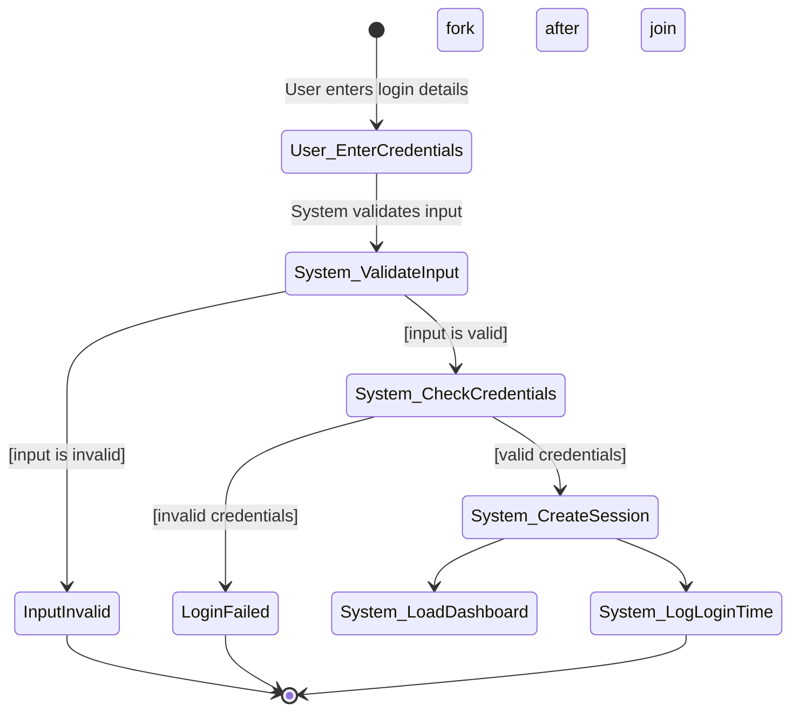
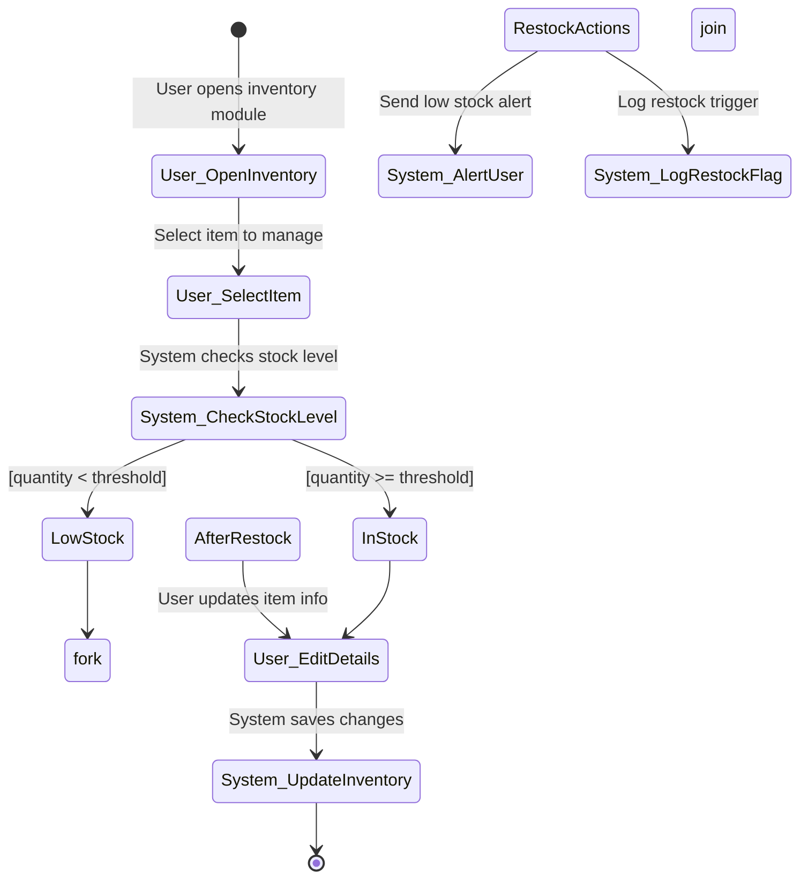
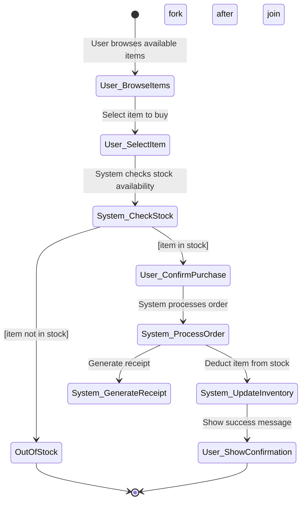
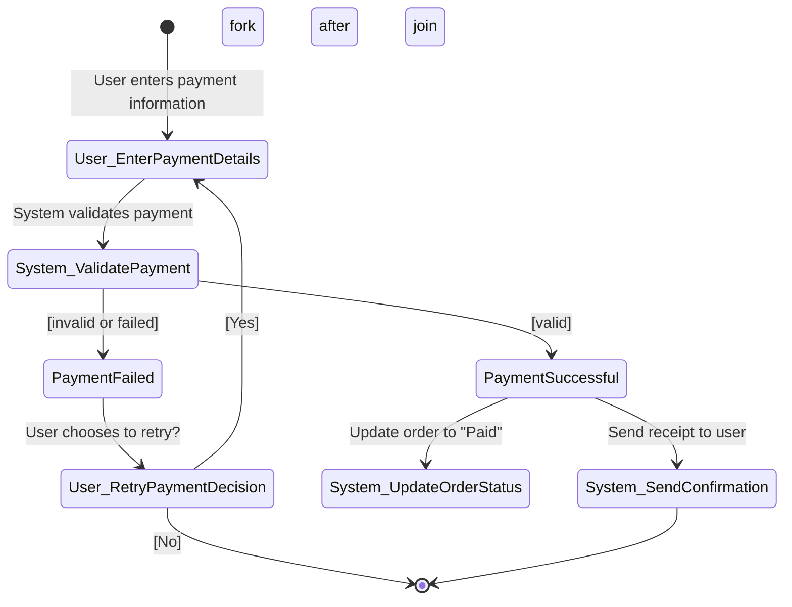
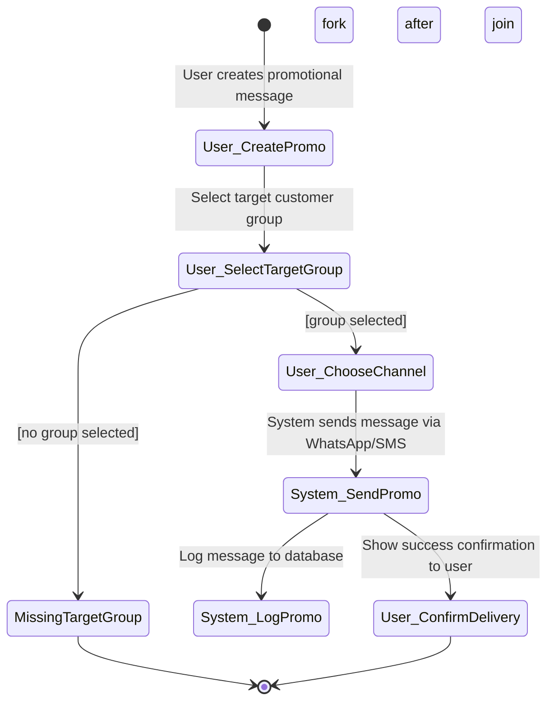
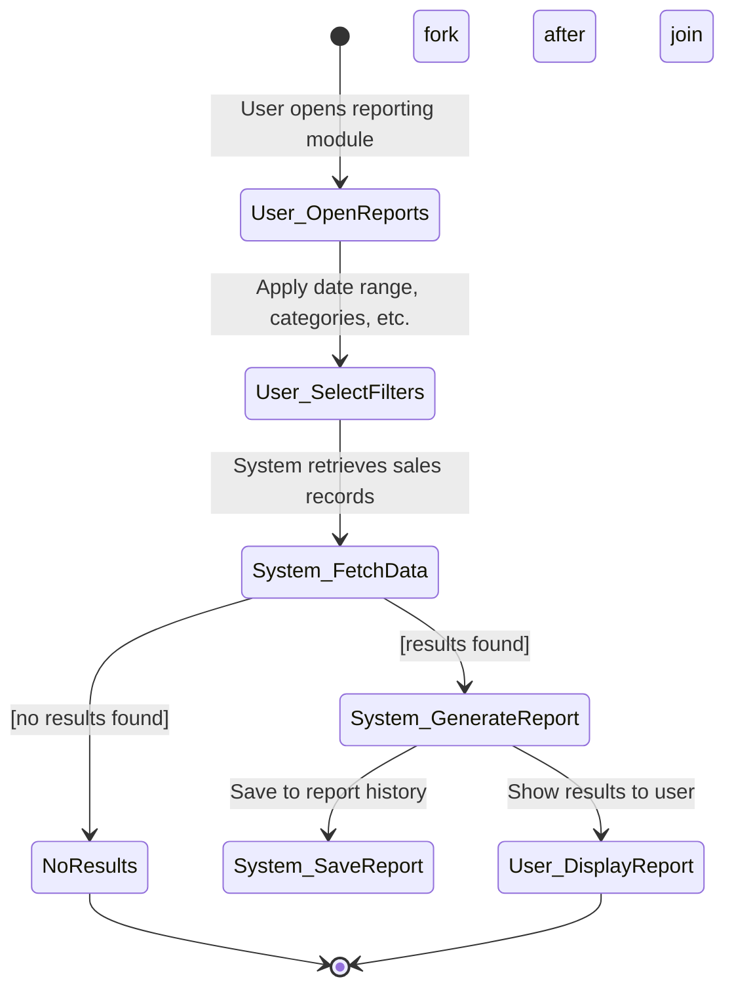
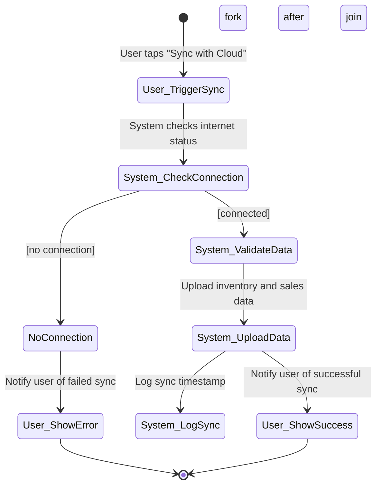
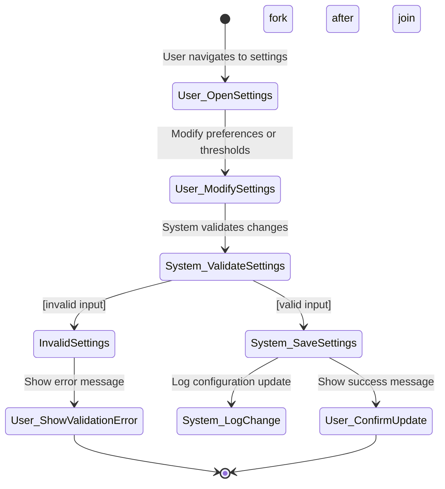

## User Login & Access

```mermaid
stateDiagram-v2
    [*] --> User_EnterCredentials : User enters login details
    User_EnterCredentials --> System_ValidateInput : System validates input

    System_ValidateInput --> InputInvalid : [input is invalid]
    InputInvalid --> [*]

    System_ValidateInput --> System_CheckCredentials : [input is valid]
    System_CheckCredentials --> LoginFailed : [invalid credentials]
    LoginFailed --> [*]

    System_CheckCredentials --> System_CreateSession : [valid credentials]

    fork after System_CreateSession
        System_CreateSession --> System_LoadDashboard
        System_CreateSession --> System_LogLoginTime
    join after System_LogLoginTime

    System_LogLoginTime --> [*]
```
## Manage Inventory

```mermaid
stateDiagram-v2
    [*] --> User_OpenInventory : User opens inventory module
    User_OpenInventory --> User_SelectItem : Select item to manage
    User_SelectItem --> System_CheckStockLevel : System checks stock level

    System_CheckStockLevel --> LowStock : [quantity < threshold]
    System_CheckStockLevel --> InStock : [quantity >= threshold]

    LowStock --> fork RestockActions

    RestockActions --> System_AlertUser : Send low stock alert
    RestockActions --> System_LogRestockFlag : Log restock trigger

    join AfterRestock

    AfterRestock --> User_EditDetails : User updates item info

    InStock --> User_EditDetails
    User_EditDetails --> System_UpdateInventory : System saves changes
    System_UpdateInventory --> [*]
```
## Make Purchase

```mermaid
stateDiagram-v2
    [*] --> User_BrowseItems : User browses available items
    User_BrowseItems --> User_SelectItem : Select item to buy
    User_SelectItem --> System_CheckStock : System checks stock availability

    System_CheckStock --> OutOfStock : [item not in stock]
    OutOfStock --> [*]

    System_CheckStock --> User_ConfirmPurchase : [item in stock]
    User_ConfirmPurchase --> System_ProcessOrder : System processes order

    fork after System_ProcessOrder
        System_ProcessOrder --> System_GenerateReceipt : Generate receipt
        System_ProcessOrder --> System_UpdateInventory : Deduct item from stock
    join after System_UpdateInventory

    System_UpdateInventory --> User_ShowConfirmation : Show success message
    User_ShowConfirmation --> [*]
```
## Process Payment

```mermaid
stateDiagram-v2
    [*] --> User_EnterPaymentDetails : User enters payment information
    User_EnterPaymentDetails --> System_ValidatePayment : System validates payment

    System_ValidatePayment --> PaymentFailed : [invalid or failed]
    PaymentFailed --> User_RetryPaymentDecision : User chooses to retry?

    User_RetryPaymentDecision --> [*] : [No]
    User_RetryPaymentDecision --> User_EnterPaymentDetails : [Yes]

    System_ValidatePayment --> PaymentSuccessful : [valid]

    fork after PaymentSuccessful
        PaymentSuccessful --> System_UpdateOrderStatus : Update order to "Paid"
        PaymentSuccessful --> System_SendConfirmation : Send receipt to user
    join after System_SendConfirmation

    System_SendConfirmation --> [*]
```
## Send promotional message

```mermaid
stateDiagram-v2
    [*] --> User_CreatePromo : User creates promotional message
    User_CreatePromo --> User_SelectTargetGroup : Select target customer group

    User_SelectTargetGroup --> MissingTargetGroup : [no group selected]
    MissingTargetGroup --> [*]

    User_SelectTargetGroup --> User_ChooseChannel : [group selected]
    User_ChooseChannel --> System_SendPromo : System sends message via WhatsApp/SMS

    fork after System_SendPromo
        System_SendPromo --> System_LogPromo : Log message to database
        System_SendPromo --> User_ConfirmDelivery : Show success confirmation to user
    join after User_ConfirmDelivery

    User_ConfirmDelivery --> [*]
```
## Generate sales report

```mermaid
stateDiagram-v2
    [*] --> User_OpenReports : User opens reporting module
    User_OpenReports --> User_SelectFilters : Apply date range, categories, etc.
    User_SelectFilters --> System_FetchData : System retrieves sales records

    System_FetchData --> NoResults : [no results found]
    NoResults --> [*]

    System_FetchData --> System_GenerateReport : [results found]

    fork after System_GenerateReport
        System_GenerateReport --> System_SaveReport : Save to report history
        System_GenerateReport --> User_DisplayReport : Show results to user
    join after User_DisplayReport

    User_DisplayReport --> [*]
```
## Sync data with cloud

```mermaid
stateDiagram-v2
    [*] --> User_TriggerSync : User taps "Sync with Cloud"
    User_TriggerSync --> System_CheckConnection : System checks internet status

    System_CheckConnection --> NoConnection : [no connection]
    NoConnection --> User_ShowError : Notify user of failed sync
    User_ShowError --> [*]

    System_CheckConnection --> System_ValidateData : [connected]
    System_ValidateData --> System_UploadData : Upload inventory and sales data

    fork after System_UploadData
        System_UploadData --> System_LogSync : Log sync timestamp
        System_UploadData --> User_ShowSuccess : Notify user of successful sync
    join after User_ShowSuccess

    User_ShowSuccess --> [*]
```
## Manage system settings

```mermaid
stateDiagram-v2
    [*] --> User_OpenSettings : User navigates to settings
    User_OpenSettings --> User_ModifySettings : Modify preferences or thresholds
    User_ModifySettings --> System_ValidateSettings : System validates changes

    System_ValidateSettings --> InvalidSettings : [invalid input]
    InvalidSettings --> User_ShowValidationError : Show error message
    User_ShowValidationError --> [*]

    System_ValidateSettings --> System_SaveSettings : [valid input]

    fork after System_SaveSettings
        System_SaveSettings --> System_LogChange : Log configuration update
        System_SaveSettings --> User_ConfirmUpdate : Show success message
    join after User_ConfirmUpdate

    User_ConfirmUpdate --> [*]
```

