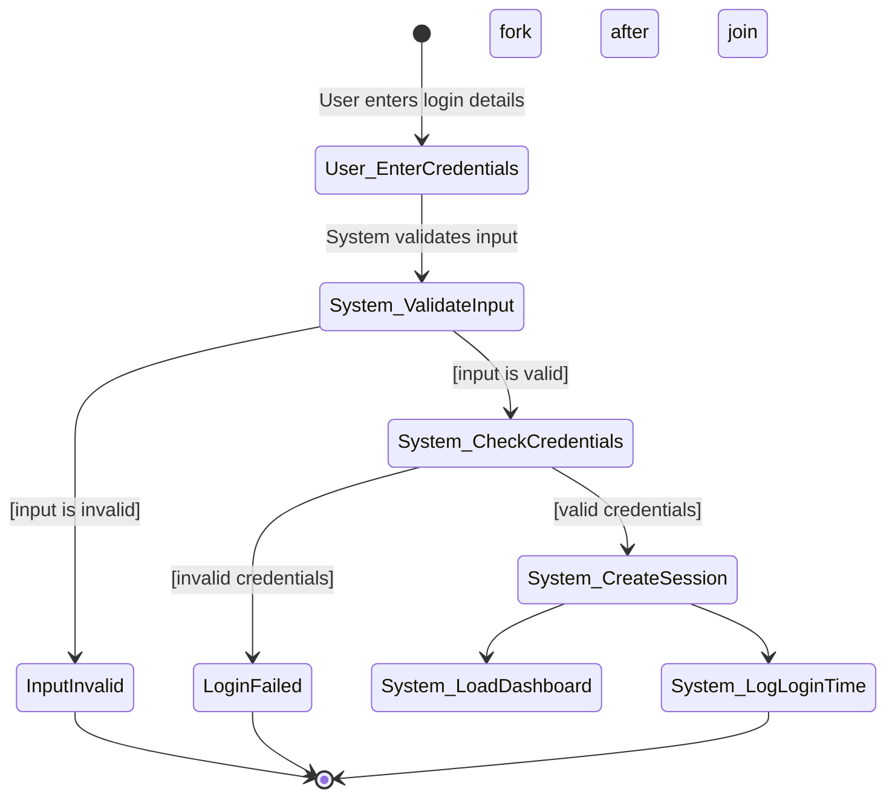

```mermaid
stateDiagram-v2
    [*] --> User_EnterCredentials : User enters login details
    User_EnterCredentials --> System_ValidateInput : System validates input

    System_ValidateInput --> InputInvalid : [input is invalid]
    InputInvalid --> [*]

    System_ValidateInput --> System_CheckCredentials : [input is valid]
    System_CheckCredentials --> LoginFailed : [invalid credentials]
    LoginFailed --> [*]

    System_CheckCredentials --> System_CreateSession : [valid credentials]

    fork after System_CreateSession
        System_CreateSession --> System_LoadDashboard
        System_CreateSession --> System_LogLoginTime
    join after System_LogLoginTime

    System_LogLoginTime --> [*]
```

