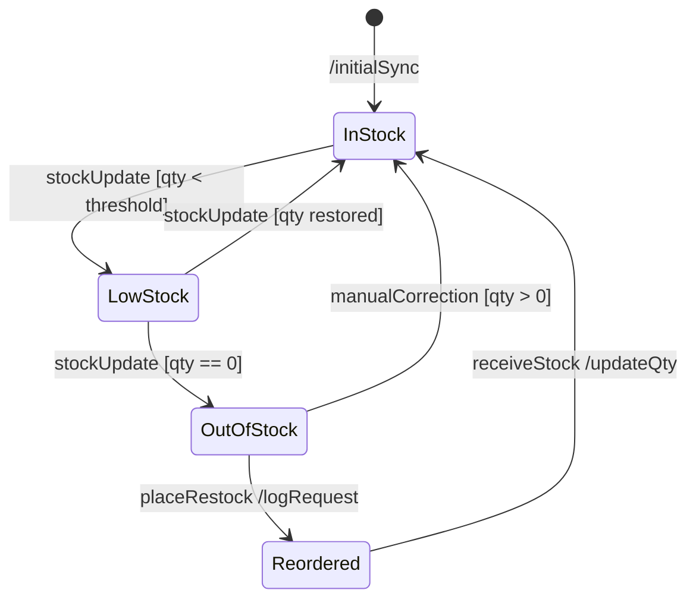
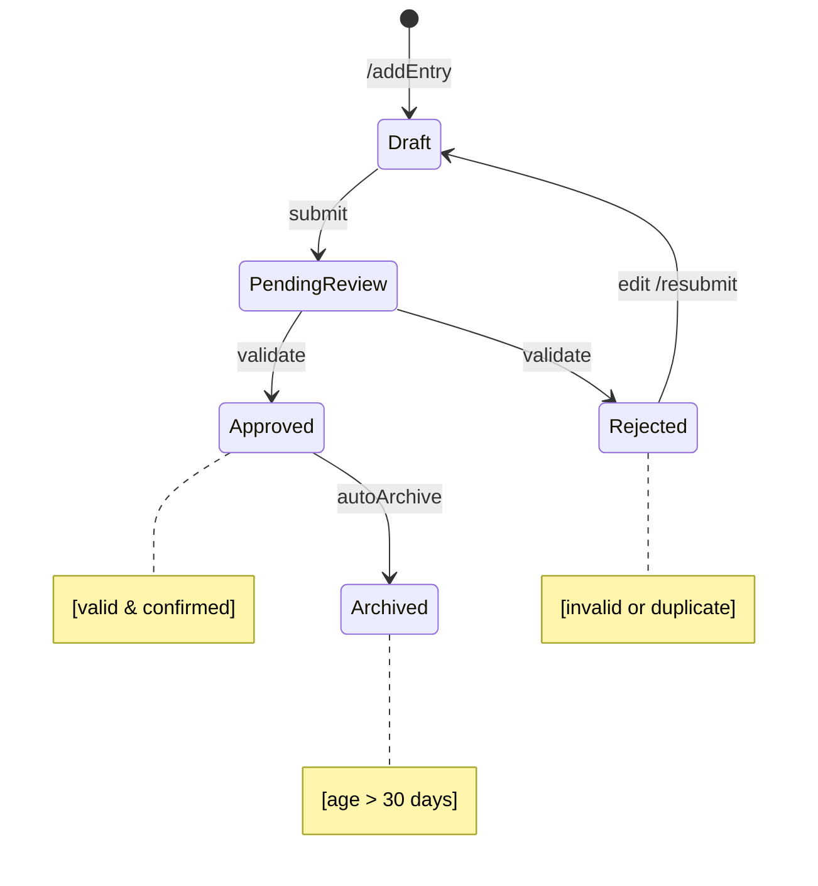
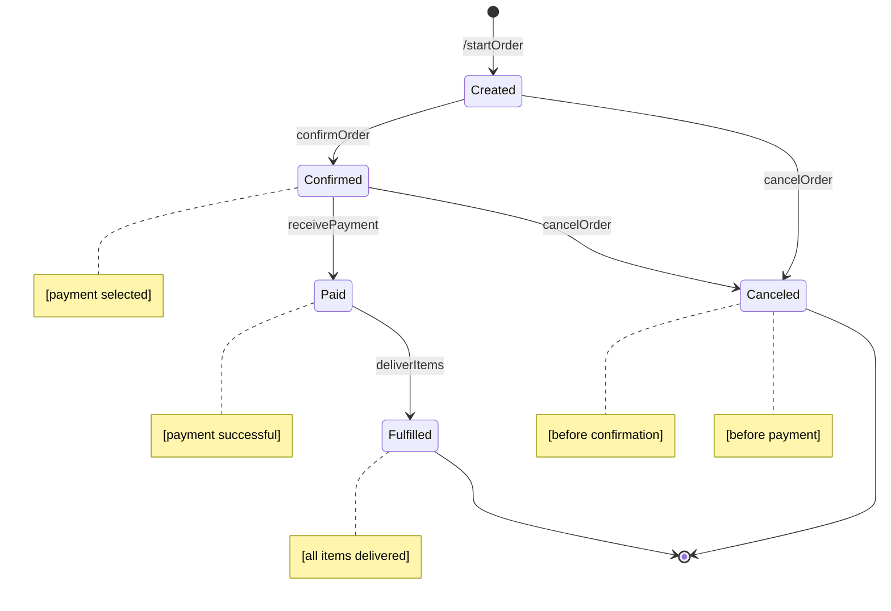
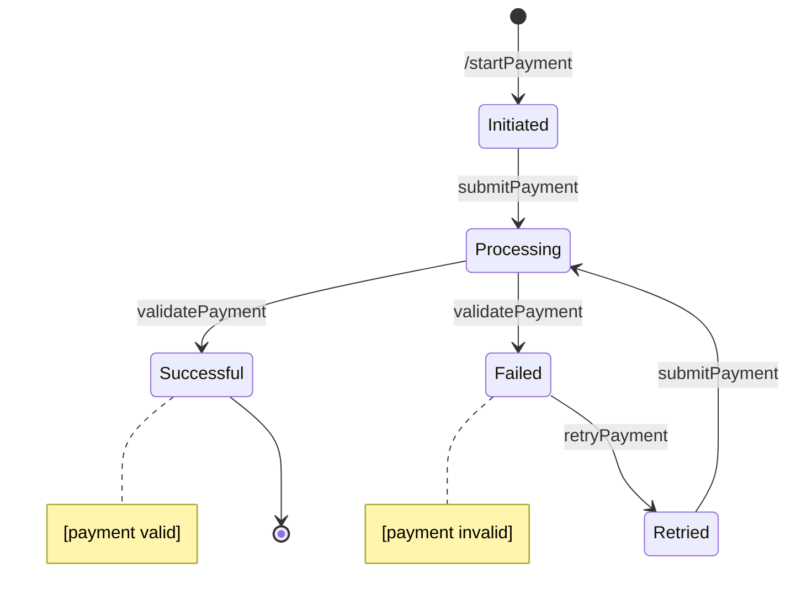
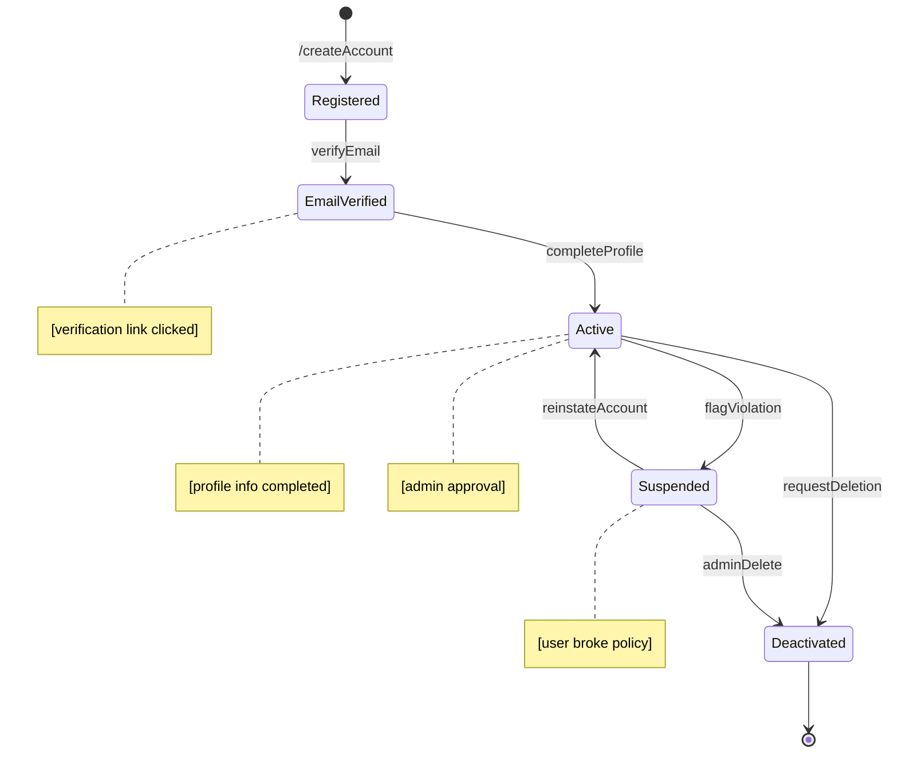
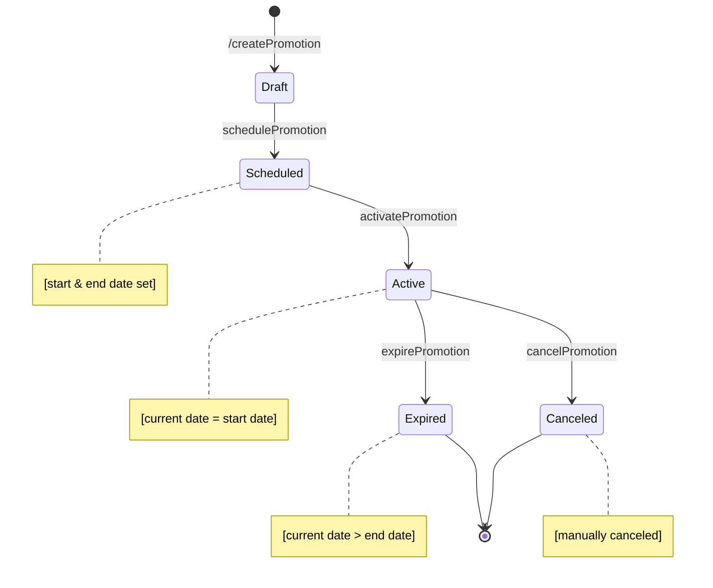
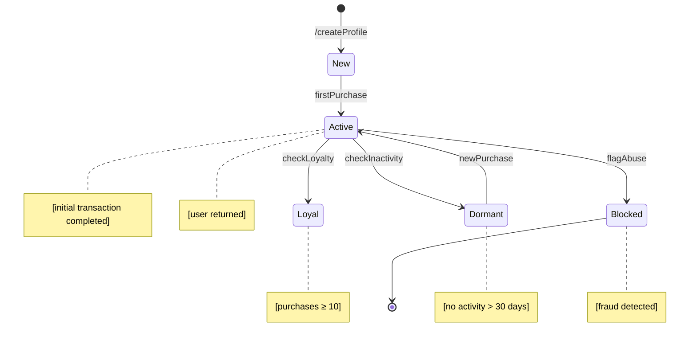

# Object State Modeling (Prioritized)

To ensure clarity and alignment with system priorities, the following state transition diagrams are organized from most critical to least critical based on their role in the SME Digitalization App. The top priority is placed on objects that directly support core operations like inventory management and financial tracking.
## Inventory Item

| Element      | Explanation                                                            |
|----------------------|----------------------------------------------------------------------------------|
| **Key States**       | InStock, LowStock, OutOfStock, Reordered                                        |
| **Key Transitions**  | stockUpdate, placeRestock, receiveStock, manualCorrection                       |
| **Guard Conditions** | qty < threshold, qty == 0, qty restored, qty > 0                                 |
| **Actions**          | /initialSync, /logRequest, /updateQty                                            |
| **FR Mapping**       | FR-002 (Inventory tracking), FR-006 (Restock alerts), FR-007 (Notifications)     |

## CashFLowEntry

| **Element**          | **Explanation**                                                                 |
|----------------------|----------------------------------------------------------------------------------|
| **Key States**       | Draft, PendingReview, Approved, Rejected, Archived                              |
| **Key Transitions**  | submit, validate, edit, autoArchive                                              |
| **Guard Conditions** | valid & confirmed, invalid or duplicate, age > 30 days                           |
| **Actions**          | /addEntry, /resubmit                                                             |
| **FR Mapping**       | FR-003 (Track income/expenses), FR-004 (Reject invalid entries), FR-006 (Archive for reporting/loans) |

## Order

| **Element**          | **Explanation**                                                                 |
|----------------------|----------------------------------------------------------------------------------|
| **Key States**       | Created, Confirmed, Paid, Fulfilled, Canceled                                   |
| **Key Transitions**  | confirmOrder, receivePayment, deliverItems, cancelOrder                         |
| **Guard Conditions** | payment selected, payment successful, before confirmation, before payment        |
| **Actions**          | /startOrder                                                                      |
| **FR Mapping**       | FR-003 (Order lifecycle), FR-005 (Cancel orders before payment), FR-006 (Delivery tracking) |

## Payment

| **Element**          | **Explanation**                                                                 |
|----------------------|----------------------------------------------------------------------------------|
| **Key States**       | Initiated, Processing, Successful, Failed, Retried                              |
| **Key Transitions**  | submitPayment, validatePayment, retryPayment                                    |
| **Guard Conditions** | payment valid, payment invalid                                                   |
| **Actions**          | /startPayment                                                                    |
| **FR Mapping**       | FR-004 (Validate payments), FR-006 (Retry failed transactions), FR-007 (Log payment attempts) |

## UserAccount

| **Element**          | **Explanation**                                                                 |
|----------------------|----------------------------------------------------------------------------------|
| **Key States**       | Registered, EmailVerified, Active, Suspended, Deactivated                       |
| **Key Transitions**  | verifyEmail, completeProfile, flagViolation, reinstateAccount, requestDeletion, adminDelete |
| **Guard Conditions** | verification link clicked, profile info completed, policy violation, admin approval |
| **Actions**          | /createAccount                                                                   |
| **FR Mapping**       | FR-001 (User onboarding), FR-005 (Admin account control), FR-006 (Deactivation rights) |

## Promotion

| **Element**          | **Explanation**                                                                 |
|----------------------|----------------------------------------------------------------------------------|
| **Key States**       | Draft, Scheduled, Active, Expired, Canceled                                     |
| **Key Transitions**  | schedulePromotion, activatePromotion, expirePromotion, cancelPromotion          |
| **Guard Conditions** | start & end date set, current date = start date, current date > end date, manually canceled |
| **Actions**          | /createPromotion                                                                 |
| **FR Mapping**       | FR-008 (Manage promotions), FR-007 (Campaign lifecycle), FR-006 (Expire/archive promos) |

## CustomerProfile

| **Element**          | **Explanation**                                                                 |
|----------------------|----------------------------------------------------------------------------------|
| **Key States**       | New, Active, Loyal, Dormant, Blocked                                            |
| **Key Transitions**  | firstPurchase, checkLoyalty, checkInactivity, newPurchase, flagAbuse           |
| **Guard Conditions** | initial transaction completed, purchases ≥ 10, no activity > 30 days, fraud detected |
| **Actions**          | /createProfile                                                                   |
| **FR Mapping**       | FR-007 (Loyalty & engagement), FR-005 (Handle dormancy), FR-006 (Flag abuse)     |

