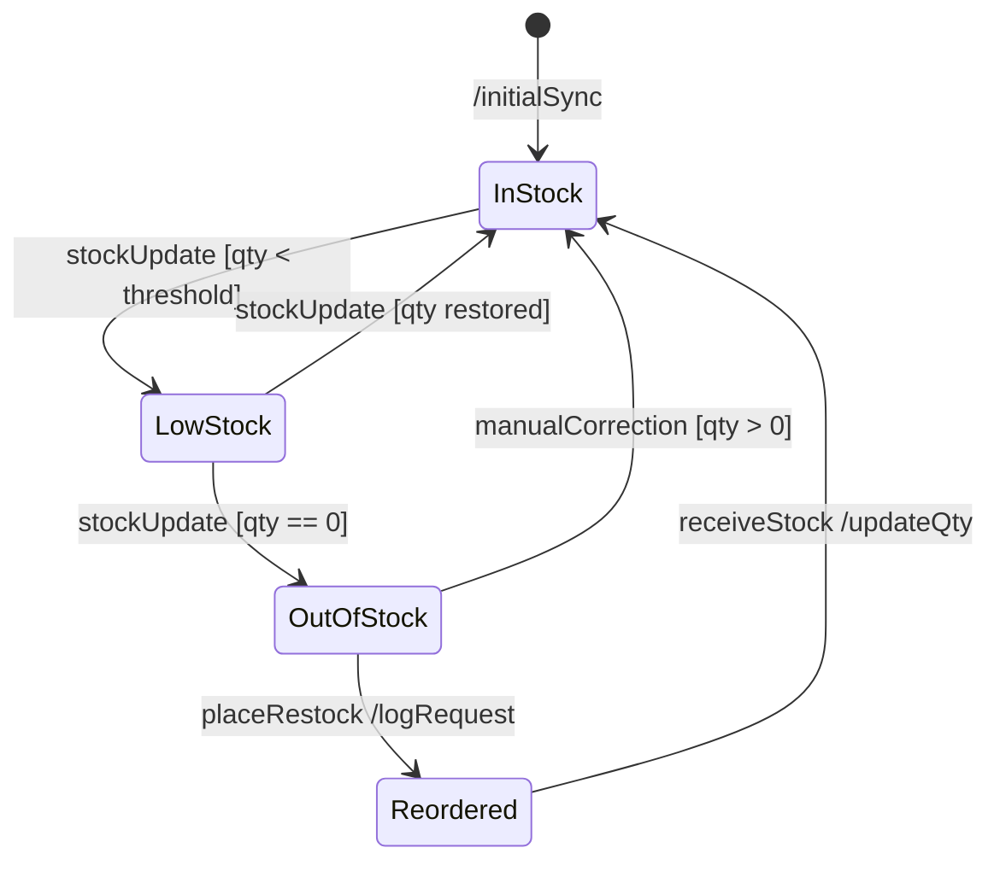
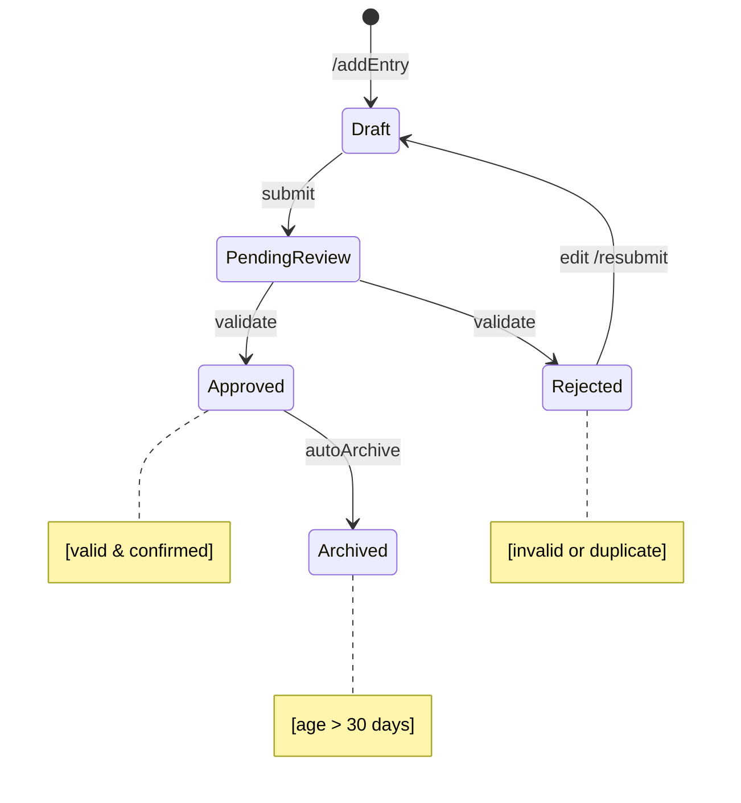
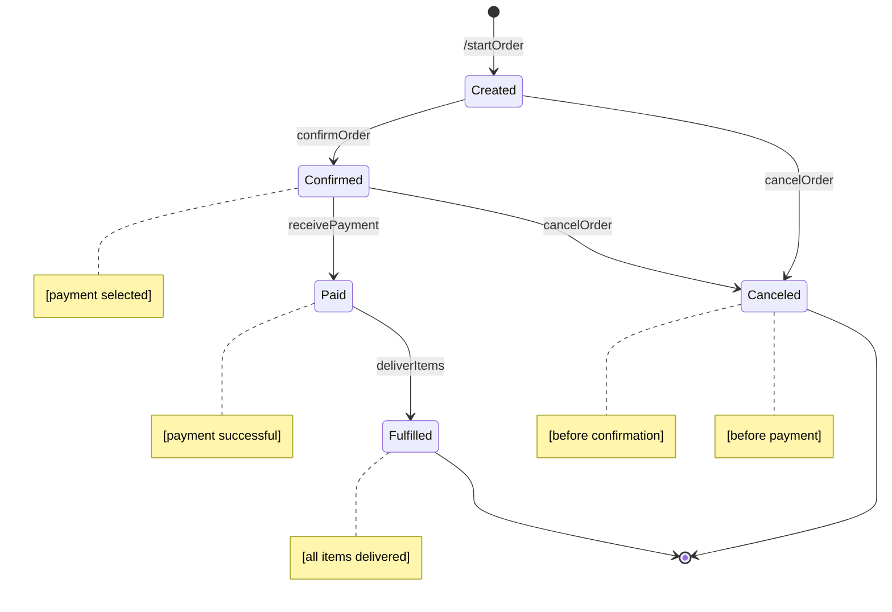
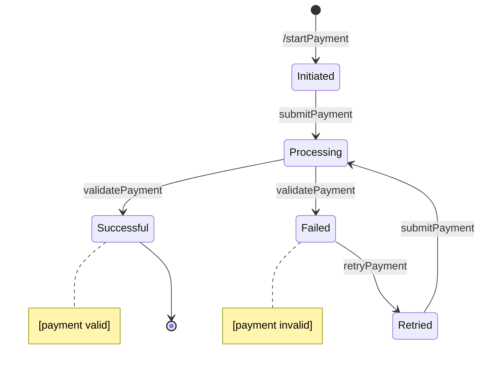
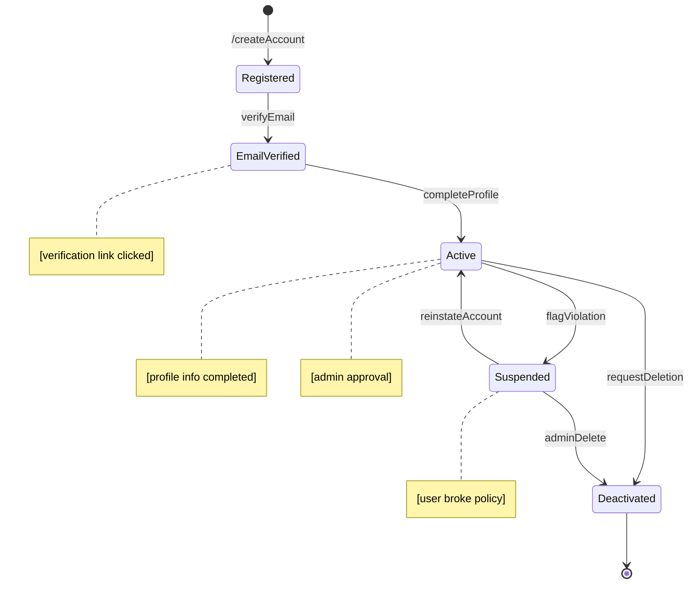
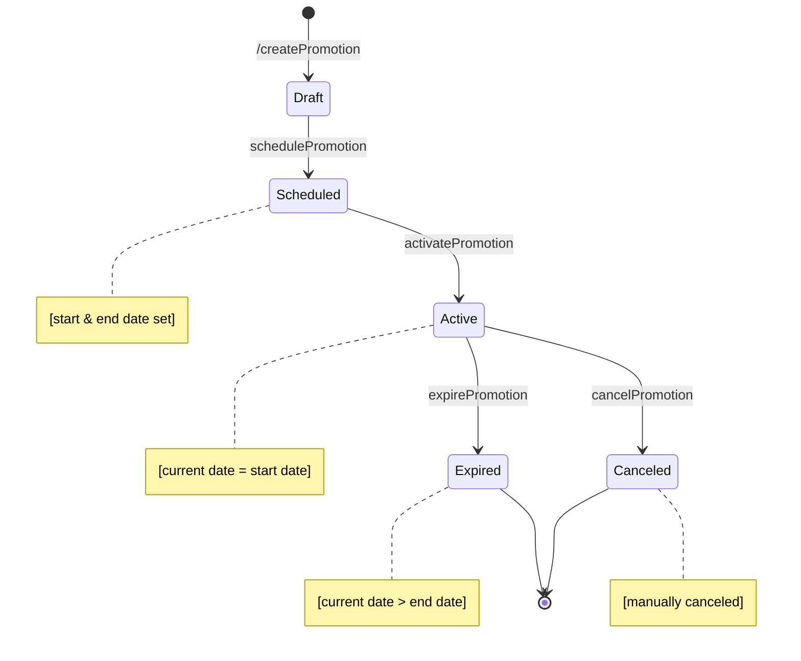
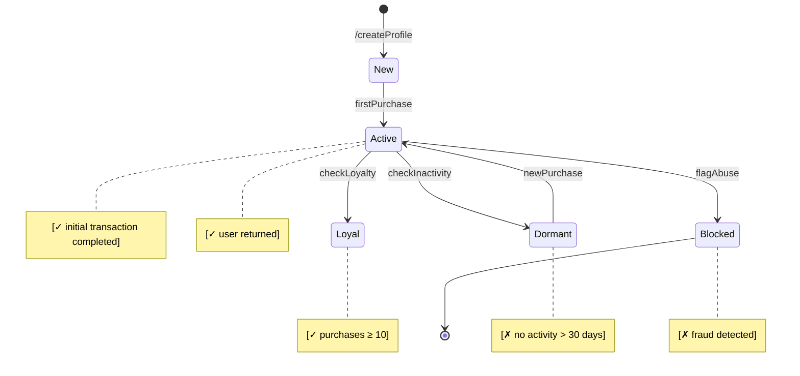

# Object State Modeling (Prioritized)

To ensure clarity and alignment with system priorities, the following state transition diagrams are organized from most critical to least critical based on their role in the SME Digitalization App. The top priority is placed on objects that directly support core operations like inventory management and financial tracking.
## Inventory Item

## CashFLowEntry

## Order

## Payment

## UserAccount

## Promotion

## CustomerProfile

